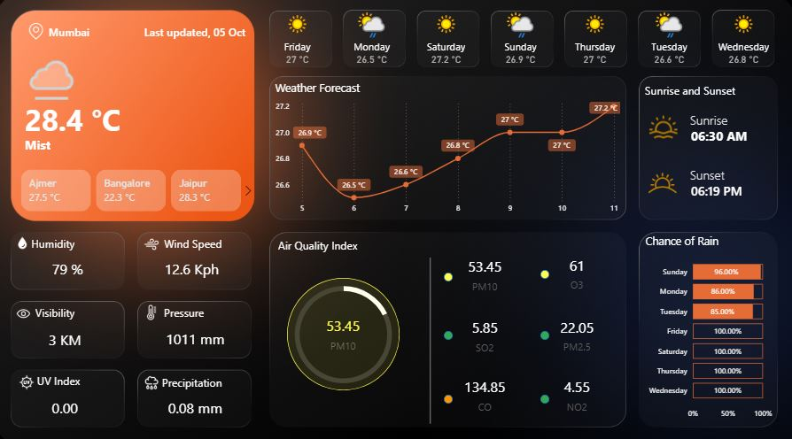

#  Weather Forcasting Data Analytics Dashboard — Power BI

An interactive **Weather Analytics Dashboard** built in **Power BI**, providing real-time and 7-day forecast insights for multiple Indian cities.  
The dashboard visualizes temperature trends, humidity, air quality, wind patterns, and other environmental factors using live API data.

---

## Project Overview

This project aims to analyze and visualize **weather and environmental data** in a clear, interactive way.  
Data is fetched from a **Weather API** and transformed for analytical reporting in **Power BI**, enabling users to monitor real-time weather conditions and trends across multiple cities.

---

##  Key Insights & Features

1. **Current Weather Summary**
  - Displays temperature, humidity, wind speed, pressure, and visibility.
  
2. **7-Day Forecast**
  - Line chart visualizing temperature trends over the next 7 days.
  
3.  **Sunrise & Sunset Tracker**
  - Highlights daily sunrise and sunset timings for the selected city.
  
4.  **Air Quality Index (AQI)**
  - Measures pollutants like PM10, PM2.5, CO, SO₂, NO₂, and O₃.
  
5.  **Rain Probability**
  - Percentage chance of rainfall visualized through a dynamic bar chart.
  
6.  **Multi-City Comparison**
  - Compare real-time weather between major cities such as Mumbai, Jaipur, Bangalore, and Ajmer.

---

##  Tools & Technologies Used

| Category | Tools / Tech |
|-----------|--------------|
| Data Source | Weather API (OpenWeatherMap or similar) |
| Data Processing | Power Query (ETL in Power BI) |
| Visualization | Microsoft Power BI Desktop |
| Data Type | JSON / CSV (transformed to Power BI Model) |
| Analytics | DAX Measures, Dynamic Filters, and Custom Visuals |

---

##  Project Workflow

1. **Data Extraction**
   - Collected weather data via API for multiple cities (7-day forecast).
   - Exported or connected to Power BI via JSON or CSV.

2. **Data Transformation**
   - Cleaned and structured data using **Power Query**.
   - Created calculated columns and measures using **DAX**.

3. **Dashboard Development**
   - Built dynamic visuals for temperature, AQI, rain probability, and more.
   - Used cards, line charts, bar charts, and gauges for better clarity.

4. **Insights & Analysis**
   - Compared inter-city weather patterns.
   - Monitored pollution levels and rain forecasts across locations.

---

##  Project Files
```
weather-analytics-dashboard/
├── Weather.pbix 
├── Dashboard.jpg
├── README.md 
└── icons/icons.jpg
└── Background/background.jpg
```
---
## Dashboard Screenshots


##  How to Use

1. **Download the .pbix file**  
   - Clone or download this repository.
   - Open the file `Weather_Dashboard.pbix` in Power BI Desktop.

2. **Connect or Refresh Data**
   - If using live API data, update the API key or endpoint in Power Query.
   - Otherwise, refresh the dataset to load the latest CSV or JSON data.

3. **Explore the Dashboard**
   - Use slicers to select cities.
   - Analyze weather parameters interactively.

---

##  Cities Covered

- Mumbai  
- Jaipur  
- Bangalore  
- Ajmer  

(You can easily extend to more cities using the same API.)

---

## Future Enhancements

- Integration of **real-time API refresh** through Power BI Service.  
- Addition of **global city-level analytics**.  
- Implementation of **alert-based notifications** for severe weather conditions.  
- Integration with **Azure Data Factory** for automated data ingestion.

---

## Author

**Priyansh Jain**  
 [GitHub: @priyanshjain9414](https://github.com/priyanshjain9414)  
 [Email: priyanshjain903@gmail.com](mailto:priyanshjain903@gmail.com)

---

##  Support

If you found this project insightful, don’t forget to **star  the repository** on GitHub and share your feedback!

---


